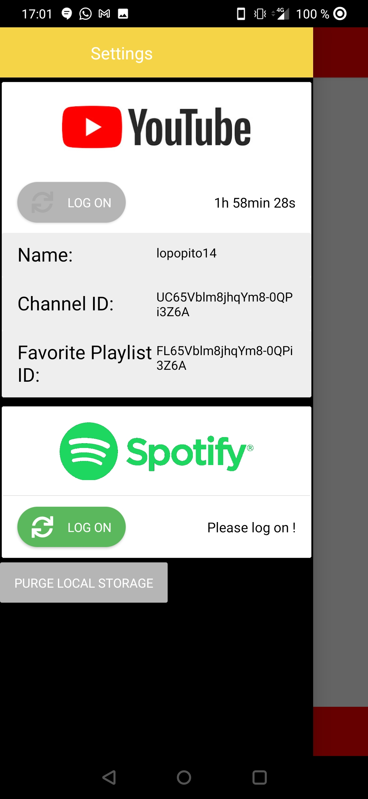
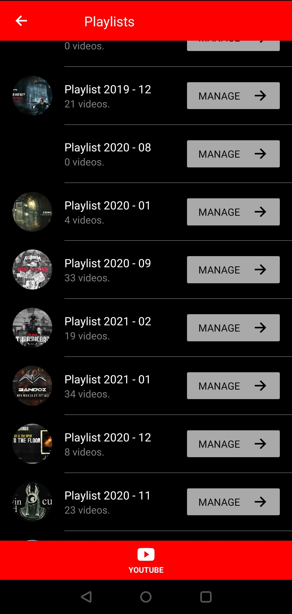
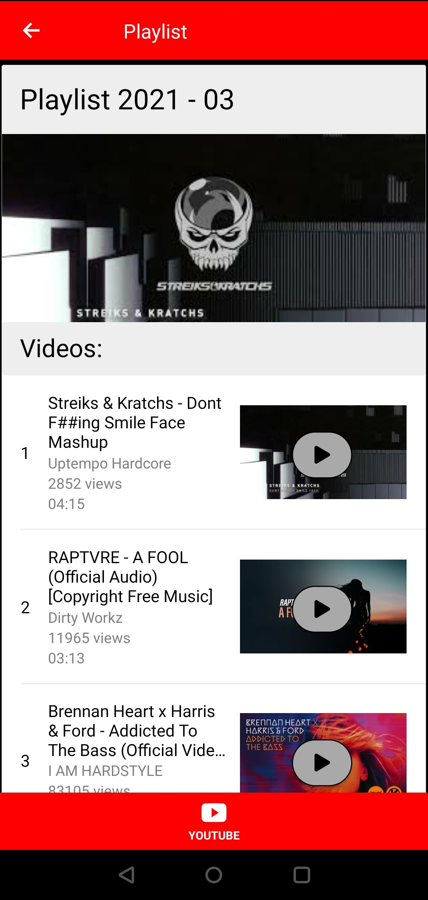
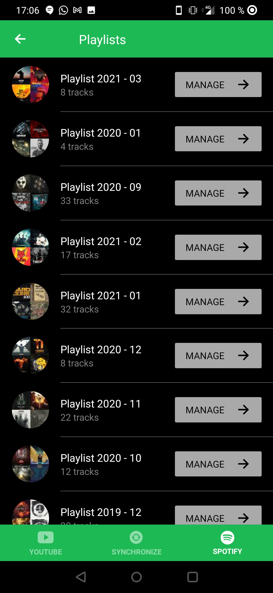
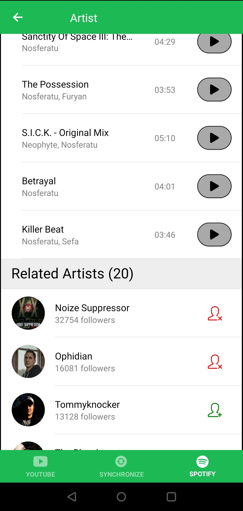
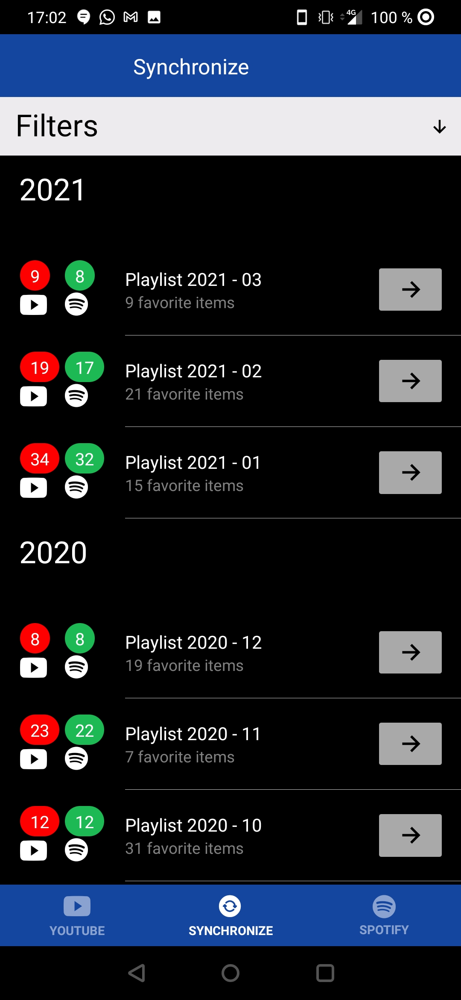
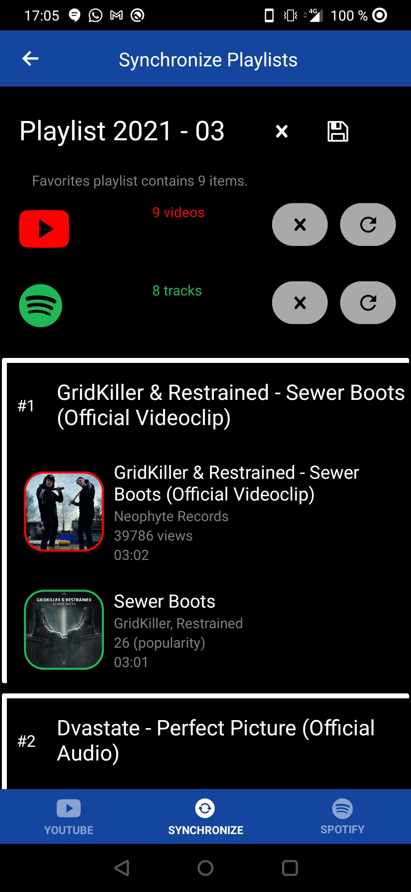
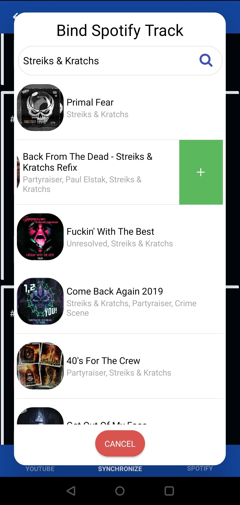

# Youtify

---

## &#9989; About the application

This android application uses Youtube and Spotify APIs to manage your playlists. You automatically create monthly playlists and easilly synchronize them.

---

## &#9989; Screenshots

### &#8594; Settings

    

### &#8594; Youtube

    
    

### &#8594; Spotify

    
    

    

### &#8594; Synchronize

    
    

    

